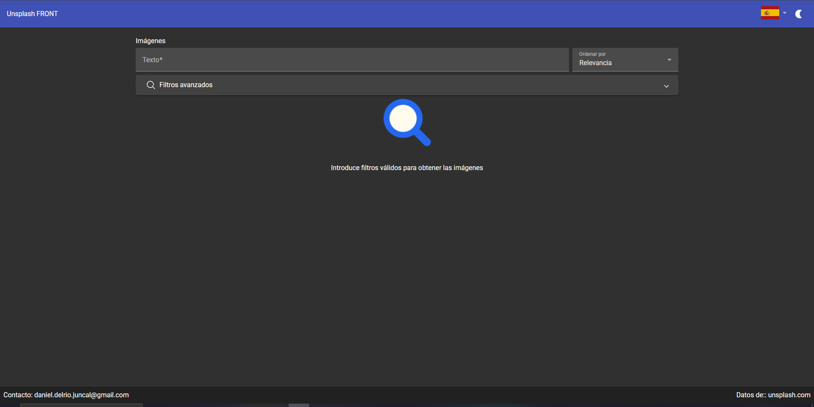
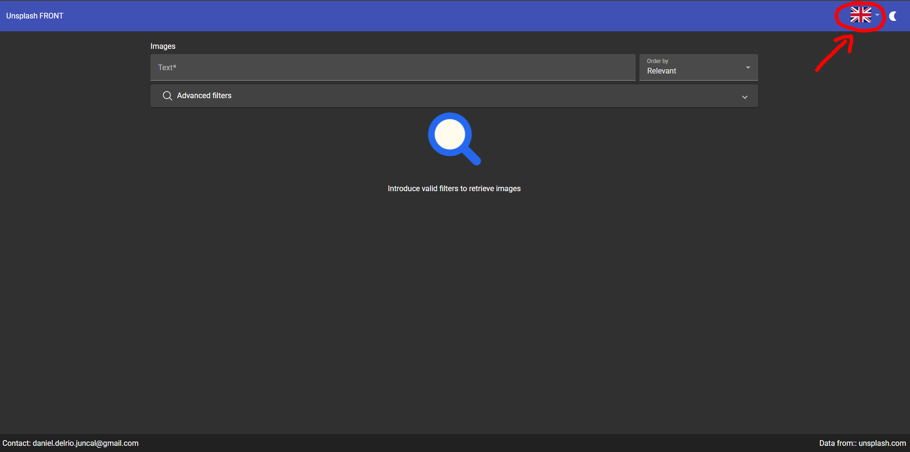
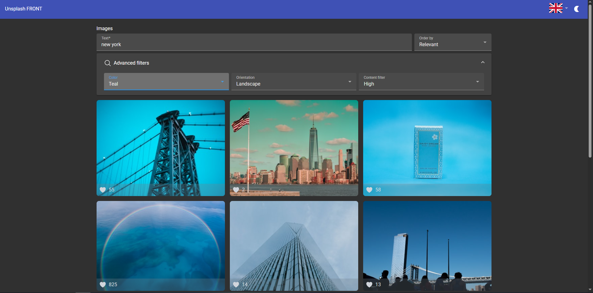
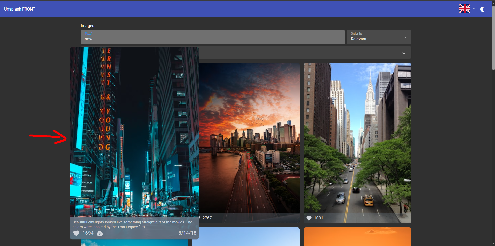
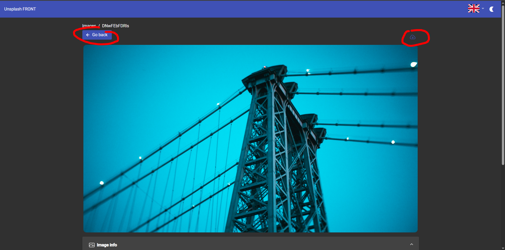
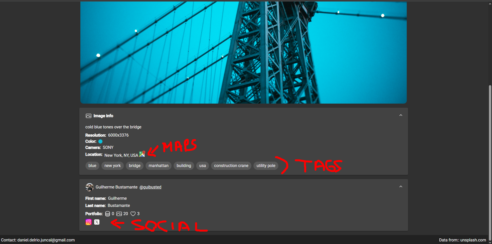
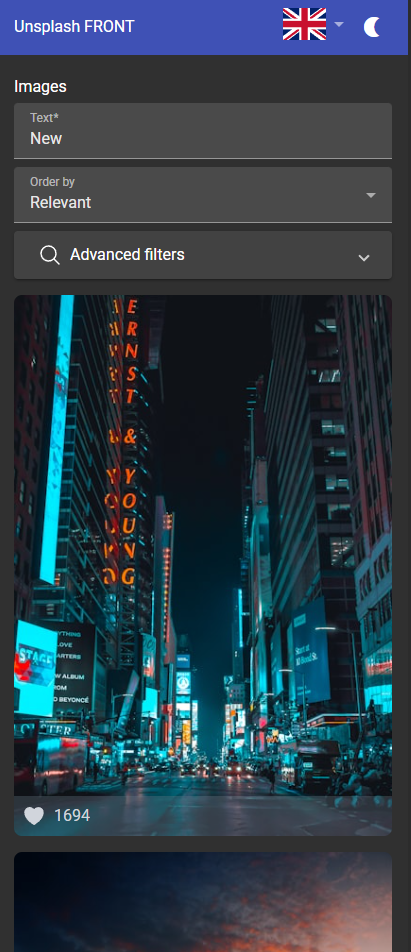
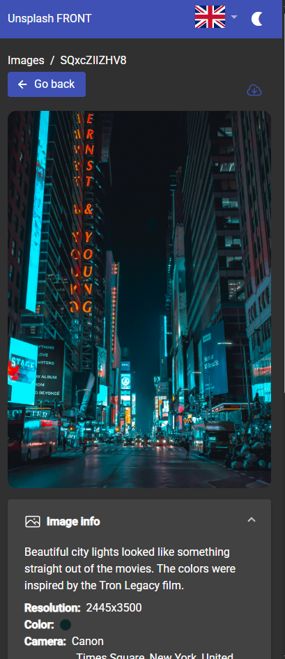
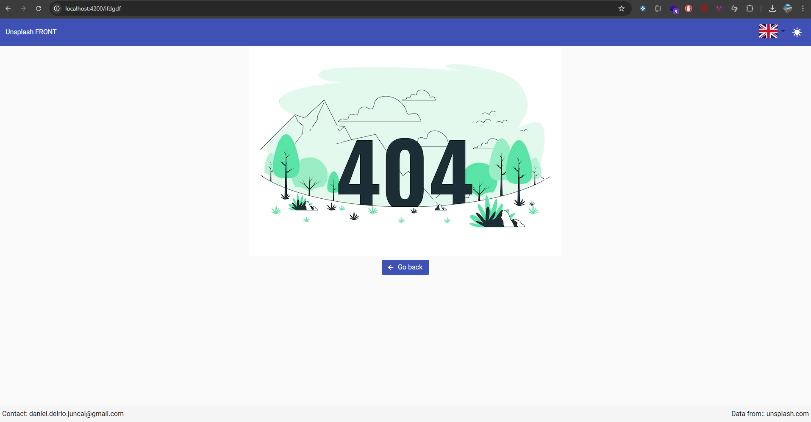
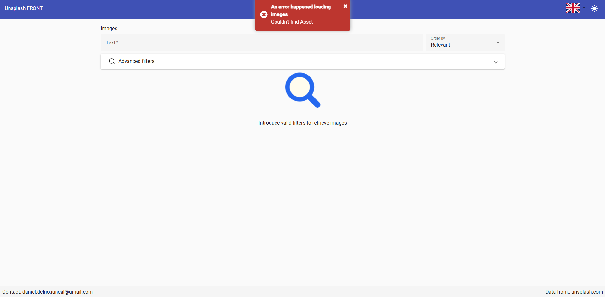

# Run locally and feature guide

This document contains a link to a guide of how to run this web locally, and a demostration of the main features of this web.

- [Installation](./doc/run_locally.md)
- [Features](#features)
- [Deployed website](https://unsplash.danidelrio.es)

## Features

### Toolbar

In the following picture you can see the main view, with a toolbar at the top, and a main section at the center with a search component.

The toolbar has a language and a theme selector on the right, that allows the user to change the language (by default the browser language is chosen) and a theme (dark or light, default based on the system)

### Search component

In the center, we have the search component, that is divided in 2 parts, the basic one (text and order) and the advanced part (color, orientation and content filter).
You can perform searchs just by typing or changing them, and the search is applyed automatically once you stop interacting with it.
The filters are stored on the url on query params and also read from them, so you can reload or share the link with other people.

### Image grid with infinite scroll

Once a search is performed, the user can scroll, while new images are lazily loaded just before achieving the end of the scroll
Hovering the images with the mouse, you can see the description and a download button, and by cliking you can go to the detail screen

Image hover

Infinite scroll

### Image detail

In the detail screen you can see the image bigger and with additional information, like the resolution, camera used to take the picture, location (with a redirect to Google Maps) and tags, that can perform a search if clicked
We have a "Go back" button, that allows the user to go to the exact same search as before, and a download button

If the scroll down, we see also the User info that uploaded the picture, his/her stats and some links to his Unsplash profile and social media links.

### Responsiveness

We have done the website with responsiveness in mid, so every device can be used with the website.

Responsive main:

Responsive detail:

### Error handling

If the user tries to go to a unexistent location, a 404 page is shown

If user tries to load an unexisten image, a toast error is shown

The website is deployed in [unsplash.danidelrio.es](https://unsplash.danidelrio.es)
